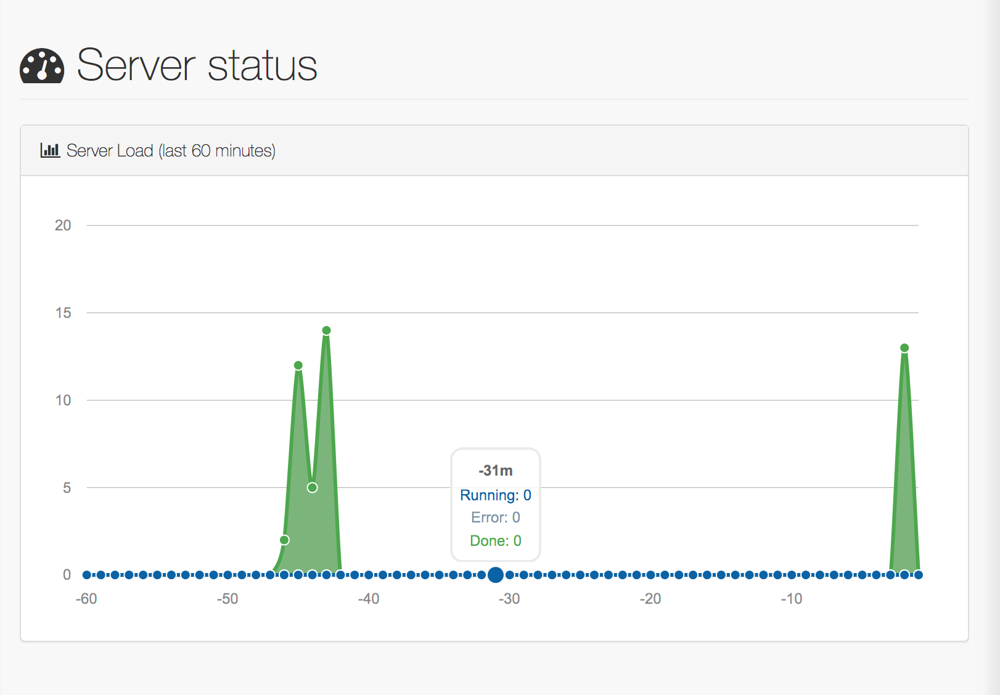

# RNA Science Toolbox

* [Basic installation](#basic-installation)
  * [Prerequisites](#prerequisites)
    * [Python environment](#python-environment)
    * [Fabric](#fabric)
    * [Docker](#docker)
  * [RNA Science Toolbox dependencies](#rna-science-toolbox-dependencies)
    * [Python libraries](#python-libraries)
    * [RNA algorithms](#rna-algorithms)
  * [Environment Configuration](#environment-configuration)
* [Quickstart](#quickstart)
  * [Ipython](#ipython)
  * [Jupyter Notebooks](#jupyter-notebooks)
* [Advanced installation](#advanced-installation)
  * [RNA 3D modeling](#rna-3d-modeling)
  * [Web Services](#web-services)

The RNA Science Toolbox provides a Python API (PyRNA) to do RNA science on Linux (mainly Ubuntu) and MacOSX. PyRNA allows you to:

* parse RNA data from "classical" file formats (PDB, CT, FASTA, VIENNA,...) and convert them into easy-to-use and easy-to-analyse data structures:
  * [Pandas Series and DataFrames](http://pandas.pydata.org/pandas-docs/stable/dsintro.html)
  * "PyRNA objects" (as defined in the module pyrna.features).
* compute RNA data from RNA algorithms (see below for details) and convert them into Pandas data structures and PyRNA objects,
* recover RNA data from public databases ([PDB](http://www.rcsb.org/pdb/home/home.do), [RFAM](http://rfam.sanger.ac.uk),...) and convert them into Pandas data structures and PyRNA objects,
* deploy some functionalities as REST Web services.

This project is related to the [DockeRNA project](https://github.com/fjossinet/DockeRNA) which provides Docker images containing the RNA algorithms you may need.

The RNA Science Toolbox provides also a bunch of [Jupyter](http://jupyter.org) notebooks [to demo the basic features](#quickstart). You can have a look at them by following these links:

* [Create and manipulate molecules](https://nbviewer.jupyter.org/github/fjossinet/RNA-Science-Toolbox/blob/master/notebooks/Create%20and%20manipulate%20molecules.ipynb)
* [Create and manipulate alignments](https://nbviewer.jupyter.org/github/fjossinet/RNA-Science-Toolbox/blob/master/notebooks/Create%20and%20manipulate%20alignments.ipynb)
* [Create and manipulate secondary structures](https://nbviewer.jupyter.org/github/fjossinet/RNA-Science-Toolbox/blob/master/notebooks/Create%20and%20manipulate%20secondary%20structures.ipynb)
* [Create and manipulate tertiary structures](https://nbviewer.jupyter.org/github/fjossinet/RNA-Science-Toolbox/blob/master/notebooks/Create%20and%20manipulate%20tertiary%20structures.ipynb)

You can [follow this project on twitter](https://twitter.com/RnaSciToolbox) to get updates as they happen.

# Basic installation

To use the RNA Science Toolbox, you will need to go through several steps. But don't be afraid, each step is really easy to follow.

If you don't care about the details, you can go directly to the instructions **copy/paste in a terminal**.

We will provide soon a script allowing to fully configure an Ubuntu [openstack](https://www.openstack.org) image with the RNA Science toolbox.

## Prerequisites

### Python environment

You need at first to have a Python distribution installed on your computer. If you don't have one, we recommend you a distribution like [Anaconda](https://www.continuum.io/why-anaconda).

If you're using Linux Ubuntu, **copy/paste in a terminal**:

    wget "https://repo.continuum.io/archive/Anaconda2-5.0.1-Linux-x86_64.sh"
    chmod u+x ./Anaconda2-5.0.1-Linux-x86_64.sh
    ./Anaconda2-5.0.1-Linux-x86_64.sh
    bash

### Fabric

You also need the tool [Fabric](http://www.fabfile.org).

If you're using the [Anaconda distribution](https://www.continuum.io/why-anaconda) on Linux Ubuntu/MacOSX, **copy/paste in a terminal**:

    conda install fabric

### Docker

To install the RNA algorithms, you need first to get a tool named [Docker](https://www.docker.com).

If you're using Linux Ubuntu, **copy/paste in a terminal**:

    curl -fsSL https://download.docker.com/linux/ubuntu/gpg | sudo apt-key add -
    sudo add-apt-repository \
        "deb [arch=amd64] https://download.docker.com/linux/ubuntu \
        $(lsb_release -cs) \
        stable"
    sudo apt-get update
    sudo apt-get install docker-ce

In order to run docker as non-root user, you need to add your user to the docker group.

**Copy/paste in a terminal**:

    sudo usermod -a -G docker $USER

You will perhaps need to reboot:

    sudo reboot

## RNA Science Toolbox dependencies

### Python libraries

Once done, download the RNA Science Toolbox and go into its directory. To install its Python dependencies, you can use either the package manager conda (from the [Anaconda distribution](https://www.continuum.io/why-anaconda)) or pip.

If you're using Linux Ubuntu/MacOSX, **copy/paste in a terminal**:

    fab python

To use pip, type:

    fab python:manager=pip

### RNA algorithms

Each Docker image available contains several algorithms:

* [fjossinet/assemble2](https://hub.docker.com/r/fjossinet/assemble2/): provides [RNAVIEW](http://ndbserver.rutgers.edu/ndbmodule/services/download/rnaview.html), [Vienna RNA package](https://www.tbi.univie.ac.at/RNA/), [foldalign](http://rth.dk/resources/foldalign/), [LocARNA](http://rna.informatik.uni-freiburg.de/LocARNA/)
* [fjossinet/rnaseq](https://hub.docker.com/r/fjossinet/rnaseq/): provides [SAMtools](http://samtools.sourceforge.net), [Tophat2](https://ccb.jhu.edu/software/tophat/), [Bowtie2](http://bowtie-bio.sourceforge.net/bowtie2/index.shtml)

If you need more details about these images, check their Web page.

To install these images, **copy/paste in a terminal**:

    fab docker

## Environment Configuration

In the configuration file of your shell (.bashrc, .zshrc,...), add the following lines:

    export TOOLBOX=THE_PATH_TO_YOUR_RNA_SCIENCE_TOOLBOX
    export PYTHONPATH=$PYTHONPATH:$TOOLBOX
    export PATH=$PATH:$TOOLBOX/pyrna:$TOOLBOX/scripts/python:$PATH

If you're using bash on Linux Ubuntu/MacOSX, **copy/paste in a terminal**:

    cat <<EOT >> $HOME/.bashrc
    export TOOLBOX="\$HOME/RNA-Science-Toolbox"
    export PYTHONPATH=\$PYTHONPATH:\$TOOLBOX
    export PATH=\$PATH:\$TOOLBOX/pyrna:\$TOOLBOX/scripts/python:\$PATH
    EOT

    bash

Restart your shell and type:

    pyrna_tests.py

Your RNA Science Toolbox is fully configured if you get something like:

<pre>
Recovering entry 1EHZ from Protein Databank...

## 3D annotation ##

List of base-pairs computed with RNAVIEW:

edge1 edge2 orientation  pos1  pos2
0      (     )           c     1    72
1      (     )           c     2    71
2      (     )           c     3    70
[...]
</pre>

# Quickstart

## Ipython

To automatically import the PyRNA API from the IPython REPL, go into the directory $HOME/.ipython/profile_default/startup. Create a file named load_config.py containing the following lines:

<pre>
from pyrna.db import *
from pyrna.features import *
from pyrna.computations import *
from pyrna.parsers import *
from pyrna.utils import *
</pre>

Start a new IPython session from the command-line and type directly, without any import:

<pre>
pdb = PDB()
tertiary_structures = parse_pdb(pdb.get_entry('1EHZ'))
for ts in tertiary_structures:
  print ts.rna.sequence
</pre>

## Jupyter Notebooks

The RNA Science Toolbox provides also a bunch of notebooks to demo the basic features. **Copy/paste in a terminal**:

    fab jupyter

Then, from the notebooks folder of the RNA Science Toolbox, type in a terminal:

    jupyter notebook

This will open a Web browser listing all the notebooks available.

# Advanced installation

## RNA 3D modeling

If you're interested in 3D modeling with the tool [Assemble2](http://www.bioinformatics.org/assemble/index.html), you will need to import, annotate and store RNA 3D fragments derived from PDB structures.

To do so, you will need first to install [MongoDB](https://www.mongodb.com/fr) on your computer.

If you're using Linux Ubuntu, **copy/paste in a terminal**:

    fab mongodb

With OSX, you can use [homebrew](https://brew.sh/index_fr.html) and **copy/paste in a terminal**:

    brew update ; brew install mongodb ; brew services start mongodb

Once MongoDB installed, you need to feed the database with RNA 3D fragments. To do so **copy/paste in a terminal**:

    import_3Ds.py -annotate
    import_3Ds.py -annotate -rna3dhub

Be patient, each import takes a while. I recommend you to do these imports in a [screen](https://www.gnu.org/software/screen/manual/screen.html) session.

## Web Services

The RNA Science Toolbox allows you to give access to some of its functionalities as Web Services. These services are made available through a Web server.

### Node.js

You need to have [node.js](https://nodejs.org/en/) installed on your computer.

### Install the Web server dependencies

From the directory of the RNA Science Toolbox, **copy/paste in a terminal**:

    fab website

### Launch the Web server

**Copy/paste in a terminal**:

    cd $TOOLBOX/pyrna
    ./server.py

Open your browser at [http://localhost:8080](http://localhost:8080)

You should get a Web page displaying the load of your server for the last 60 minutes. The chart is updated each minute.

You can use a custom hostname and/or port by typing:

    cd $TOOLBOX/pyrna
    ./server.py -h your_hostname_OR_IP_adress -p your_port

Open your browser at http://your_hostname_OR_IP_adress:your_port
